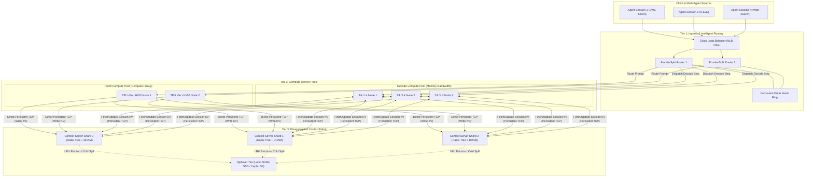

# FrontierSplit: Cloud Architecture & Horizontal Scaling Specification

## 1. Executive Summary & Vision

FrontierSplit is designed to scale horizontally across commodity cloud infrastructure (GCP, AWS, Azure, on-premises Kubernetes) to serve multi-turn compound AI agent workloads (e.g., DSPy, OpenHands, Devin-style SWE swarms).

Traditional monolithic LLM serving frameworks (vLLM, TGI, TensorRT-LLM) couple prefill compute, autoregressive decode compute, and Key-Value (KV) cache memory onto the same GPU devices. In high-concurrency multi-agent environments, this tight coupling causes severe architectural bottlenecks:
1. **Prefill-Decode Interference**: Heavy, bursty prompt prefill runs (e.g., 32k-token repository codebases) preempt or stall low-latency token-by-token decoding streams.
2. **VRAM Memory Stranding**: GPUs must allocate huge VRAM buffers for KV caches, leaving compute cores (Tensor Cores) idle while waiting for memory bandwidth.
3. **Prefix Cache Fragmentation**: Multi-turn agent threads hitting different worker replicas cannot share or reuse system prompt and repository KV activations.

FrontierSplit solves this by disaggregating inference into **three independently scalable tiers**:
- **Tier 1: Ingress Gateway & Prefix-Aware Intelligent Routers**
- **Tier 2: Compute Worker Pools (Dedicated Prefill vs. Decode Nodes)**
- **Tier 3: Distributed Disaggregated Context Memory Fabric (Sharded Context Servers)**



---

## 2. Generalized Zero-Threshold KV Memory Architecture

### 2.1 The Case Against Arbitrary Thresholds
In earlier architectural discussions, a candidate approach was maintaining an arbitrary sequence-length threshold (e.g., $N = 512$ tokens), keeping KV caches local to the worker for short queries and offloading to remote Context Servers only when $N > 512$.

FrontierSplit strictly adopts a **generalized zero-threshold design**:
1. **Elimination of Thrashing & Branching**: Dual-path logic (local vs. remote) introduces state synchronization races, cache coherence bugs, and memory fragmentation when requests cross the threshold mid-generation.
2. **Deterministic Memory Footprint on Workers**: Because workers do not permanently retain large session KV pools in GPU VRAM, decode workers can run with minimal static memory, allowing higher micro-batch concurrency.
### 2.2 Generalized Request Lifecycle
1. **Ingress & Prefix Lookup**:
   - The ingress router tokenizes the incoming message list $[t_1, t_2, \dots, t_M]$.
   - The router queries the designated Context Server shard for the longest matching prefix $[t_1, \dots, t_K]$ ($K \le M$).
2. **Prefill Phase (If $K < M$)**:
   - If $K < M$, the suffix tokens $[t_{K+1}, \dots, t_M]$ are dispatched to an available **Prefill Worker**.
   - The prefill worker computes the forward pass over the suffix, generating new Key-Value activations.
   - The prefill worker streams the computed KV tensors directly to the target Context Server shard over persistent TCP (`MSG_STORE_KV`), updating the Radix Tree.
3. **Autoregressive Decode Phase**:
   - The first token is dispatched to a **Decode Worker**.
   - For each generation step, the decode worker updates the session KV state via the Context Fabric or maintains a lightweight sliding-window local buffer with periodic chunk commits.
4. **Session Reclamation**:
   - Once the generation completes or the client closes the SSE connection, the gateway issues `ReleaseSessionPacket` to free transient decode buffers, while the shared prefix branch remains pinned in the Radix Tree.

### 2.3 Empty & Zero-Length Message Validation
API clients or automated agent tools can occasionally submit empty message payloads (`messages: []` or `content: ""`).
- **Strict Ingress Validation**: An empty messages array (`messages: []`) is rejected immediately at Tier 1 with HTTP 400 Bad Request (`InvalidRequestError: 'messages' cannot be empty`), adhering to standard OpenAI API specifications.
- **Graceful Zero-Length Content Fallback**: If an agent sends an empty content string (`content: ""`) with only role markers, the router defaults to a canonical BOS (Beginning-of-Sequence) token fingerprint (`0x00000000`). This avoids division-by-zero, hash exceptions, or cluster routing thrashing.

### 2.4 Multi-Tiered Inference Caching: Exact Output vs. Probability Distribution vs. KV Prefix

A key architectural insight in large-scale serving is that **not all caching belongs at the KV tensor layer**:
When two requests are identical (or short messages like single-word greetings or standard system checks), the system evaluates caching across three tiers:

```
                  Incoming Prompt Request
                             │
            ┌────────────────┴────────────────┐
            ▼                                 ▼
   Temperature == 0.0                Temperature > 0.0
 (Deterministic Greedy)            (Stochastic Sampling)
            │                                 │
     Exact Match in                    Exact Match in
   Exact Response Cache?             Probability Cache?
     ├── YES: Return Output (0 FLOPs)  ├── YES: Sample 1st token from
     │        Latency: < 0.5 ms        │        precomputed top-k logits
     └── NO:  Evaluate Prefix Cache    └── NO:  Evaluate Prefix Cache
                    │                                 │
                    ▼                                 ▼
            ┌─────────────────────────────────────────────────┐
            │ Tier 2: Radix Tree KV Prefix Cache              │
            │   • Reuses precomputed K & V tensors over TCP   │
            │   • Skips O(N) prefill matrix multiplications   │
            │   • Generates fresh stochastic completion       │
            └─────────────────────────────────────────────────┘
```

1. **Tier 0: Exact Response Cache (Deterministic Zero-Compute)**:
   - For greedy/deterministic requests (`temperature == 0.0`), an identical prompt will mathematically generate the exact same token sequence every time.
   - For recurring queries (e.g. "Hello", "Ping", standard test probes, benchmark evaluation prompts), computing forward passes over GPU Tensor Cores is completely redundant.
   - The Gateway checks an in-memory LRU response cache. On hit, it immediately returns the JSON or streams the pre-generated SSE tokens in $<0.5\text{ ms}$ with **zero GPU compute**.
2. **Tier 1: Probability Distribution / Logit Caching (Stochastic Randomization)**:
   - When users require non-deterministic sampling (`temperature > 0.0`), returning the exact same response is undesirable.
   - However, for an identical prompt, the **first-token logit distribution** (the output vector of vocabulary probabilities) is 100% deterministic.
   - Instead of re-running the heavy prompt prefill GEMM just to obtain the first token distribution, the Context Server can cache the top-$k$ logits / probability distribution for the prompt.
   - The Gateway samples the first token directly from this pre-calculated distribution, and then resumes autoregressive decoding from the pre-cached KV state.
3. **Tier 2: Disaggregated Radix KV Prefix Cache (Partial Common Prefixes)**:
   - For multi-turn agent threads, document reasoning, and codebases where prompts share a large common prefix (e.g. 5,000-token codebase) but end with unique questions.
   - Skips the heavy $O(N)$ prefill computation for the shared prefix while executing standard autoregressive decoding for the novel continuation.

---

## 3. Tier 1: Ingress Gateway & Prefix-Aware Intelligent Routing

### 3.1 Dual Routing Strategy: Explicit Session Affinity vs. Prefix Fingerprinting
Standard frontier LLM APIs (OpenAI Assistants API, Anthropic Messages API, Cohere, Fable) balance two routing modalities:
1. **Explicit Session Affinity (`X-Session-ID` / `session_id`)**:
   - For multi-turn conversational agents (DSPy swarms, OpenHands, SWE-bench threads), the client supplies an explicit session identifier (`X-FrontierSplit-Session-ID`).
   - The router hashes this session ID directly to the consistent hash ring.
   - **Guaranteed Invariant**: All subsequent turns of that conversation land on the exact same Context Server shard, guaranteeing that accumulated turn history is retained without state synchronization overhead across shards.
2. **Implicit Prefix Fingerprint Hashing**:
   - For stateless `/v1/chat/completions` calls where no session ID is supplied, the router extracts the leading prompt tokens (system prompts, tool definitions, Few-Shot examples) to compute a deterministic prefix fingerprint.
   - Independent requests across different users or agent processes sharing the same prompt template land on the same Context Server shard, maximizing prefix cache hits.

### 3.2 Hierarchical Prefix Hashing & Radix Tree Bucketing
A critical architectural question is: **Why not hash the entire prompt?**
- If an agent prompt has 20,000 tokens consisting of an 18,000-token codebase context and a 2,000-token user query, hashing the full prompt results in a totally different hash for every query, scattering them across different shards and reducing prefix cache hit rate to 0%.
- Instead, FrontierSplit uses **Hierarchical Prefix Bucketing**:

```
                       Incoming Prompt (20,000 Tokens)
 ┌───────────────────────────┬────────────────────────────────────────────┐
 │ Prefix Window (Tokens 0..64)│ Suffix Tokens (Tokens 65..20,000)        │
 └─────────────┬─────────────┴────────────────────────────────────────────┘
               │
               ▼ Hash Fingerprint (Murmur3 / Blake2b)
     ┌───────────────────┐
     │ Consistent Hash   │ ──► Maps to Shard 2 (Context Server)
     │ Ring (Virtual)    │
     └───────────────────┘
               │
               ▼ Forward Request to Shard 2
 ┌────────────────────────────────────────────────────────────────────────┐
 │ In-Shard Radix Tree Traversal (Fine-Grained Match)                    │
 │   • Node 0: Tokens [0..64]     (Match: 100% Hit)                       │
 │   • Node 1: Tokens [65..512]   (Match: 100% Hit)                       │
 │   • Node 2: Tokens [513..18000](Match: 100% Hit - Full Codebase KV)    │
 │   • Suffix: Tokens [18001..20000] -> Prefill needed for 2,000 tokens! │
 └────────────────────────────────────────────────────────────────────────┘
```

1. **Level 1: Coarse Shard Routing (First 64 Tokens / 512 Bytes)**:
   - The initial 64 tokens capture the base system prompt and tool definitions.
   - Consistent hashing on this prefix routes the request to the primary owning shard.
2. **Level 2: Fine-Grained Radix Tree Traversal (Within Shard)**:
   - Within the selected Context Server shard, the **Radix Tree** dynamically matches arbitrary sequence lengths ($64 \to 512 \to 4,096 \to 32,768$ tokens).
   - Any branching between different agent prompts sharing the same root prefix is cleanly resolved in memory via node splits.
3. **Level 3: Multi-Level Prefix Bucketing (Optional for 50+ Shards)**:
   - For massive clusters, if a single system prompt exceeds the memory capacity of one shard, the router can hash secondary hierarchical checkpoints (e.g. token 512, token 2048) to subdivide sub-branches across shard groups.

### 3.3 Consistent Hash Ring on Prefix Fingerprints

```
                  Hash Ring (SHA-256 Mod 2^32)
                     ┌──────────────────┐
          Shard 0 ──►│ 0x00000000       │◄── Prefix: "System: Agent..."
                     │                  │
          Shard 1 ──►│ 0x55555555       │
                     │                  │
          Shard 2 ──►│ 0xAAAAAAAA       │◄── Session ID: "sess-8f3a"
                     │                  │
          Shard 0'──►│ 0xFFFFFFFF       │ (Virtual Node)
                     └──────────────────┘
```

1. **Deterministic Shard Assignment**:
   - A fingerprint hash is calculated from the leading system prefix:
     $$\text{Key} = \operatorname{Murmur3\_32}(\text{tokens}[0 \dots \min(M, 64)])$$
   - The router maps this key to the corresponding Context Server shard on the hash ring.
   - Requests sharing identical system prompts always route their prefix cache lookups to the exact same Context Server shard, guaranteeing cache affinity.
2. **Session Affinity for Multi-Turn Agent Chains**:
   - For subsequent turns in an active agent session, the router uses the `session_id` header or conversational thread UUID to guarantee routing to the same context node.
3. **Virtual Nodes & Rebalancing**:
   - Each physical Context Server instance hosts $V = 128$ virtual nodes on the ring to guarantee uniform load distribution across memory nodes.

### 3.2 Router Responsibilities
- **HTTP / SSE Termination**: Manages client connections, TLS termination, and standard OpenAI `/v1/chat/completions` protocol semantics.
- **Micro-Batch Assembly**: Groups concurrent single-token decode requests across different sessions into dense continuous micro-batches for the Decode Workers.
- **Failover & Circuit Breaking**: If a Context Server shard fails its health probe, the router temporarily maps the virtual node interval to the next replica on the ring.

---

## 4. Tier 2: Compute Worker Pools (Disaggregated Prefill vs. Decode)

LLM inference has two diametrically opposed computational regimes:

| Characteristic | Prompt Prefill Phase | Autoregressive Decode Phase |
| :--- | :--- | :--- |
| **Compute Metric** | High FLOP/s ($O(N)$ GEMM over sequence) | Memory-bandwidth bound ($O(1)$ GEMV per step) |
| **Arithmetic Intensity**| High (Hundreds of FLOPs per byte loaded) | Extremely Low (~1–2 FLOPs per byte loaded) |
| **Optimal Hardware** | Compute-dense: Google Cloud TPU v4/v5e, NVIDIA H100, L40S | Cost-effective / Memory-bandwidth: NVIDIA L4, T4, Apple Silicon |
| **Execution Model** | Large chunked GEMM ($C = 512, 1024, 4096$) | Batched GEMV ($B = 16..64$, sequence step $s = 1$) |
| **Scaling Trigger** | Spikes in input prompt volume / repository ingest | Growth in concurrent active agent sessions |

### 4.1 Prefill Worker Pool
- **Architecture**: Contiguous pipeline stages or unified data-parallel nodes running on compute-heavy accelerators.
- **Batching Strategy**: Static chunking with Online Softmax normalization ([`frontiersplit/online_softmax.py`](file:///Users/pixel/code/FrontierSplit/frontiersplit/online_softmax.py)).
- **Interconnect**: Connects directly to the Context Fabric over high-speed datacenter VPC (10–100 Gbps). When prefill completes, activations are offloaded without occupying local VRAM.

### 4.2 Decode Worker Pool
- **Architecture**: Commodity GPU nodes running 1F1B continuous micro-batch pipelining ([`frontiersplit/scheduler.py`](file:///Users/pixel/code/FrontierSplit/frontiersplit/scheduler.py)).
- **Tile-Aligned Buffering**: Uses `WorkerKVCacheStore` with 16-token tile alignment ($\operatorname{ceil}_{16}$).
- **Elastic Auto-Scaling**: Scaled up and down based on active stream concurrency metrics emitted via `/v1/telemetry`.

### 4.3 Hardware Sizing & The Inference Roofline Model

Hardware choices across Prefill, Decode, and Context Server tiers are governed by the **Inference Roofline Model** (Arithmetic Intensity vs. Memory Bandwidth vs. VRAM Capacity).

#### 1. Per-Token KV Cache Memory Footprint
For any transformer architecture using Grouped-Query Attention (GQA), the memory consumed per stored token across all layers is:
$$\text{Bytes per Token} = 2 \times N_{\text{layers}} \times N_{\text{kv\_heads}} \times D_{\text{head}} \times B_{\text{dtype}}$$
- Factor $2$: Key and Value matrices.
- $N_{\text{layers}}$: Transformer depth.
- $N_{\text{kv\_heads}}$: Grouped-Query attention heads (8 for Llama-3-8B and Mixtral 8x7B).
- $D_{\text{head}}$: Head dimension (typically 128).
- $B_{\text{dtype}}$: Precision bytes ($2$ for FP16/BF16, $1$ for FP8).

**Concrete Calculations**:
- **Llama-3-8B (FP16)**: $2 \times 32 \times 8 \times 128 \times 2 = 131,072 \text{ bytes} \approx 128 \text{ KB / token}$.
- **Mixtral 8x7B (FP16)**: $2 \times 32 \times 8 \times 128 \times 2 = 131,072 \text{ bytes} \approx 128 \text{ KB / token}$.
- **32,768-token sequence**: $32,768 \times 128 \text{ KB} = 4.19 \text{ GB}$ per sequence.
- **16 concurrent agent streams**: $16 \times 4.19 \text{ GB} = 67.1 \text{ GB}$ of KV cache alone!

In monolithic systems, this KV volume causes immediate VRAM exhaustion on commodity 16–24 GB GPUs. In FrontierSplit, this $67.1 \text{ GB}$ lives in Tier 3 Context Server host DRAM ($128 \text{ GB} \approx \$15/\text{month}$), keeping worker VRAM usage near zero!

#### 2. Decode Memory Bandwidth vs. Latency
During single-token autoregressive decoding, arithmetic intensity is $\approx 1$ FLOP per byte loaded. The theoretical step latency $T_{\text{step}}$ is bound by memory bus speed:
$$T_{\text{step}} \ge \frac{W_{\text{active}} + B \times S \times \text{Bytes\_per\_Token}}{\text{VRAM Memory Bandwidth}}$$
$$\text{Max Throughput (tok/sec)} \approx \frac{B}{\max\left(\frac{W_{\text{active}}}{\text{Bandwidth}}, \frac{2 \times B \times \text{FLOPs}_{\text{layer}}}{\text{Compute Peak}}\right)}$$

#### 3. Cloud Accelerator Comparison & Role Assignment

| Accelerator | VRAM / HBM | Memory Bandwidth | Tensor Compute | Cost / hr | Optimal FrontierSplit Role |
| :--- | :--- | :--- | :--- | :--- | :--- |
| **NVIDIA Tesla T4** | 16 GB GDDR6 | 300 GB/s | 65 TFLOPs (FP16) | ~$0.35 | Decode Worker (Pipeline Stage) |
| **NVIDIA L4** | 24 GB GDDR6 | 300 GB/s | 120 TFLOPs (FP16)| ~$0.65 | Decode Worker (Pipeline Stage) |
| **NVIDIA A10G** | 24 GB GDDR6 | 600 GB/s | 125 TFLOPs (FP16)| ~$1.00 | High-Concurrency Decode Worker |
| **Google TPU v5e** | 16 GB HBM2 | 820 GB/s | 197 TFLOPs (BF16)| ~$1.20 | Prefill Worker (Large Batch GEMM) |
| **NVIDIA H100 SXM**| 80 GB HBM3 | 3,350 GB/s | 1,979 TFLOPs (FP8)| ~$3.50 | Prefill Pool / Central Super-Node |
| **Cloud Host RAM** | 128–512 GB DDR5 | ~100–200 GB/s | N/A (Host CPU) | ~$0.08 | Context Server Shard (Tier 3) |

---

## 5. Tier 3: Distributed Context Memory Fabric

### 5.1 Architecture of a Context Server Shard
Each Context Server shard runs as a dedicated high-memory daemon (e.g., `n2-standard-32` with 128 GB RAM or `r6i.4xlarge`):
1. **Radix Prefix Tree Index**:
   - Manages token hierarchies in memory.
   - Pointers reference precomputed FP16/FP8 Key and Value tensor slabs.
2. **Slab Memory Allocator**:
   - Pre-allocates pinned memory slabs in host DRAM (or GPU VRAM if equipped with a dedicated memory-tier GPU).
   - Prevents memory fragmentation and OS memory page faults during high-throughput tensor read/writes.
3. **Multi-Tiered Hierarchical Storage**:
   - **L1 (DRAM)**: Sub-millisecond retrieval for hot system prompts and active conversation sessions.
   - **L2 (Local NVMe SSD)**: Memory-mapped files (mmap) for warm sessions inactive for > 5 minutes.
   - **L3 (Object Storage / Cloud Storage)**: Cold persistent agent checkpoints stored asynchronously as compressed zstandard shards.

```
                    Context Server Memory Hierarchy
┌──────────────────────────────────────────────────────────────────┐
│ L1: Host DRAM (Pinned Tensors)     - Latency: < 0.2 ms           │
│     • Active agent prefixes & hot Radix tree nodes               │
├──────────────────────────────────────────────────────────────────┤
│ L2: Local NVMe SSD (mmap Store)    - Latency: < 2.0 ms           │
│     • Warm sessions, intermediate agent reasoning traces         │
├──────────────────────────────────────────────────────────────────┤
│ L3: Cloud Object Storage (S3/GCS)  - Latency: < 50 ms            │
│     • Cold checkpointed agent conversations, long-term memory     │
└──────────────────────────────────────────────────────────────────┘
```

### 5.2 Wire Protocol & Tensor Serialization
Data transfer between workers and Context Servers uses FrontierSplit's native persistent binary protocol:
- **Header**: 16-byte fixed framing header (`MAGIC=0x4653`, `MSG_TYPE`, `PAYLOAD_LEN`, `FLAGS`).
- **Zero-Copy Serialization**: High-speed numpy/torch buffer extraction directly into socket buffers using `memoryview` and `asyncio.StreamWriter`.
- **Activation Quantization (Optional FP8 / INT8)**: Uses dynamic vector-scale quantization to reduce network bandwidth consumption by 50% with zero degradation in generation accuracy.

---

## 6. Fault Tolerance, High Availability & Disaster Recovery

### 6.1 Worker Node Failure Recovery
- **Decoupled State Advantage**: In traditional systems (e.g., vLLM), if a decode worker crashes, all in-flight session KV caches stored in its VRAM are lost, forcing the client to recompute the entire prompt.
- **FrontierSplit Recovery**: Because KV state is externalized in Tier 3, if a Decode Worker node crashes:
  1. The Ingress Router detects connection loss via TCP timeout or heartbeat probe.
  2. The router re-dispatches the session to an alternative healthy Decode Worker.
  3. The new worker fetches the session KV state from the Context Server shard in one round-trip and resumes autoregressive token emission without recomputing prompt prefill.

### 6.2 Context Server Replication & Failover
- **Primary-Replica Sharding**: Each shard on the consistent hash ring maintains an active asynchronous replica on an adjacent ring position:
  $$\text{Replica}(S_i) = S_{(i+1) \bmod N}$$
- **Health Checks & Dynamic Re-mapping**: Routers perform health probes (`/health`) every 1,000 ms. If Shard $i$ fails, traffic automatically fails over to Replica $S_{i+1}$.

---

## 7. Cloud Deployment Blueprint: Kubernetes Architecture

### 7.1 Component Breakdown

| Kubernetes Workload | Role | Resource Specs | Scaling Metric |
| :--- | :--- | :--- | :--- |
| `frontiersplit-router` | Ingress Gateway, SSE Streamer, Prefix Hasher | CPU: 4–8 cores, RAM: 8 GB (Deployment) | HTTP Request Rate & In-Flight Connections |
| `frontiersplit-context-shard` | KV Cache Storage, Radix Tree Store | High Memory: 32 cores, 128–256 GB RAM + Local NVMe SSD (StatefulSet) | Total Cached Tokens & DRAM Utilization |
| `frontiersplit-prefill-pool` | Batch Prompt Prefill Engine | Compute Accelerator: 1x TPU v5e or 1x H100 / L40S (Deployment) | Prefill Token Queue Depth |
| `frontiersplit-decode-pool` | Continuous Micro-Batch Decode Pipelining | Commodity GPU: 4x L4 / T4 (StatefulSet / Deployment) | Concurrency / Bubble Factor / Tokens per Sec |

### 7.2 Sample Kubernetes Architecture Manifest

```yaml
apiVersion: apps/v1
kind: Deployment
metadata:
  name: frontiersplit-router
  namespace: frontiersplit
spec:
  replicas: 3
  selector:
    matchLabels:
      app: frontiersplit-router
  template:
    metadata:
      labels:
        app: frontiersplit-router
    spec:
      containers:
        - name: gateway
          image: ghcr.io/frontiersplit/frontiersplit:latest
          command: ["python", "-m", "frontiersplit.gateway"]
          args:
            - "--model-name=meta-llama/Llama-3-8B-Instruct"
            - "--context-cluster=frontiersplit-context-headless:50060"
            - "--port=8000"
          ports:
            - containerPort: 8000
          readinessProbe:
            httpGet:
              path: /health
              port: 8000
            initialDelaySeconds: 5
            periodSeconds: 5
---
apiVersion: apps/v1
kind: StatefulSet
metadata:
  name: frontiersplit-context-shard
  namespace: frontiersplit
spec:
  serviceName: "frontiersplit-context-headless"
  replicas: 4
  selector:
    matchLabels:
      app: frontiersplit-context-shard
  template:
    metadata:
      labels:
        app: frontiersplit-context-shard
    spec:
      containers:
        - name: context-server
          image: ghcr.io/frontiersplit/frontiersplit:latest
          command: ["python", "-m", "frontiersplit.context_server"]
          args:
            - "--host=0.0.0.0"
            - "--port=50060"
            - "--max-cached-tokens=5000000"
          resources:
            requests:
              memory: "64Gi"
              cpu: "16"
            limits:
              memory: "128Gi"
              cpu: "32"
          volumeMounts:
            - name: nvme-spillover
              mountPath: /mnt/spillover
  volumeClaimTemplates:
    - metadata:
        name: nvme-spillover
      spec:
        accessModes: ["ReadWriteOnce"]
        storageClassName: "fast-nvme-ssd"
        resources:
          requests:
            storage: 500Gi
```

---

## 8. Summary & Architectural Invariants

1. **Strictly Decoupled**: Prefill compute, decode compute, and KV cache memory scale independently with zero stranded hardware.
2. **Zero Arbitrary Thresholds**: The KV cache lifecycle is 100% unified, eliminating branch thrashing and edge cases.
3. **Prefix Affinity Without Bottlenecks**: Consistent hash rings on prefix fingerprints guarantee high cache hit rates across distributed Context Servers without requiring a central database.
4. **Resilient to Worker Failures**: Because state is externalized, decode worker crashes are non-destructive and can be transparently retried by the router.
